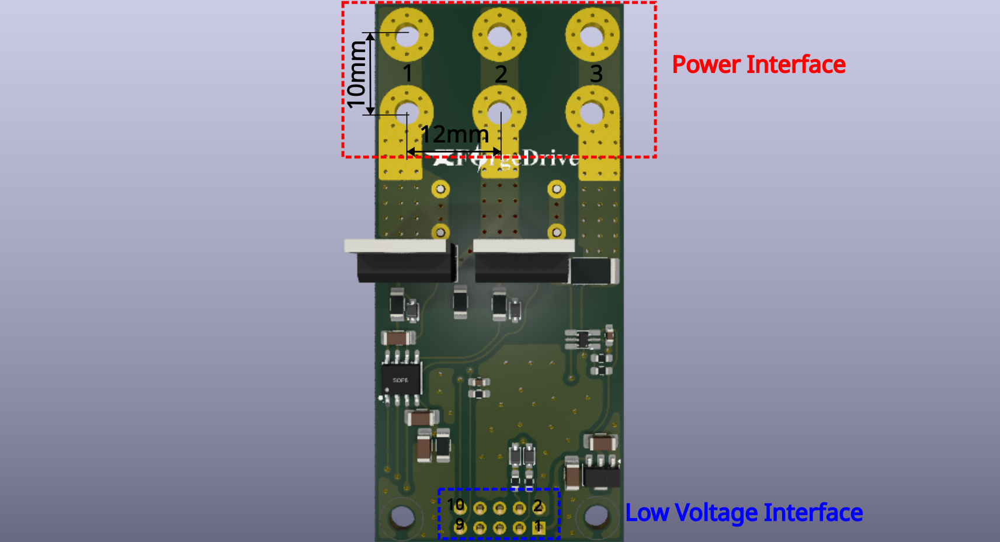
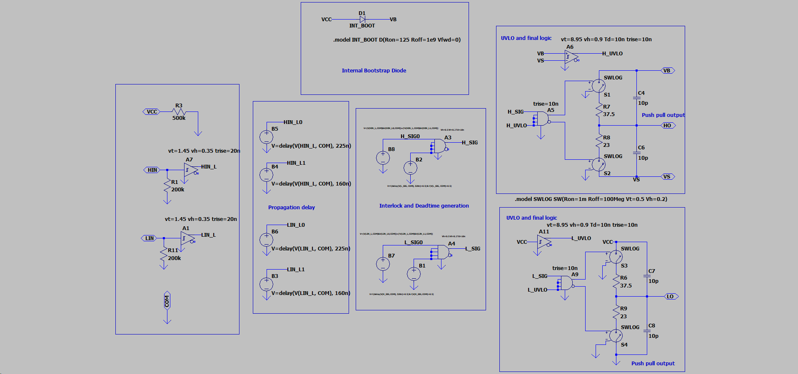
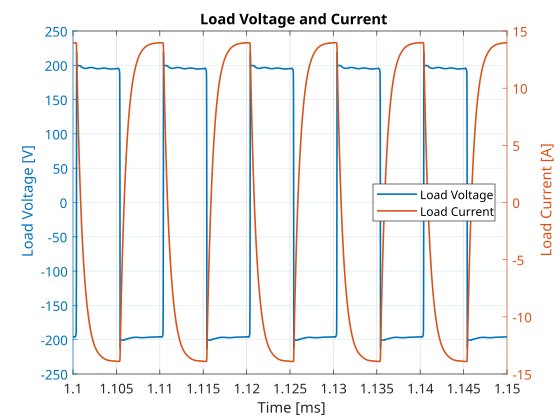
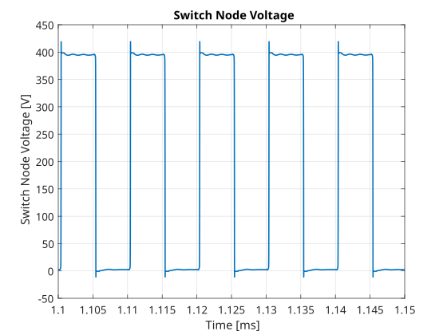
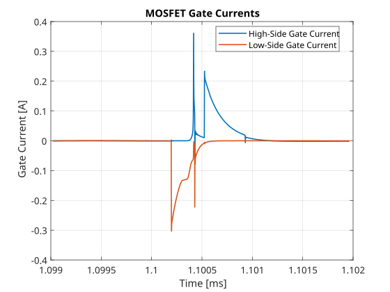
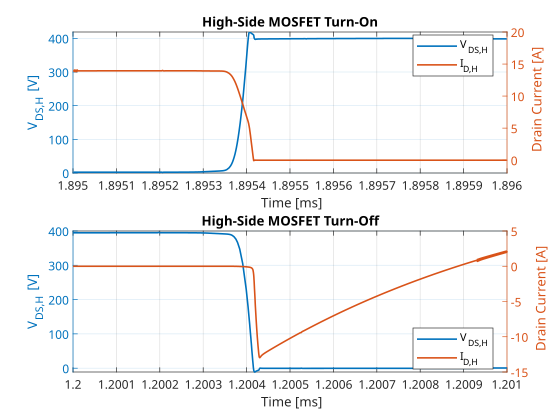
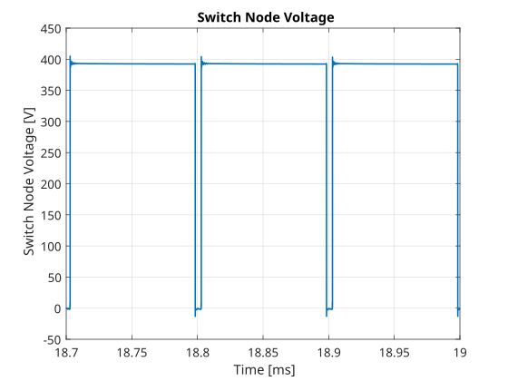
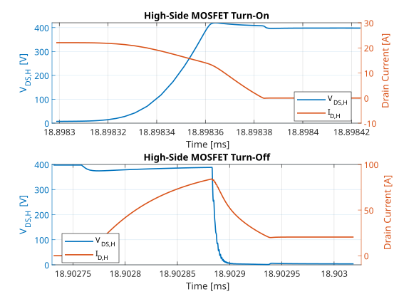
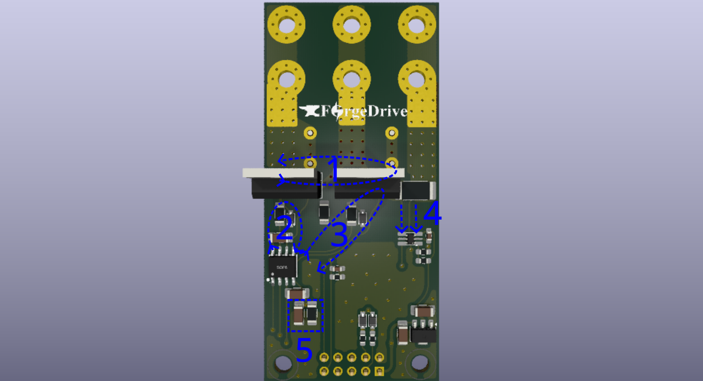

@import "../../forgex_doc_style.css"

# HBM_G0V48C15 Technical Reference

> **Project:** ForgeX  
> **Generation:** Gen0  
> **Document:** HBM_G0V48C15 Technical Reference  
> **Author:** Malak Ashraf  
> **Revision:** Rev. 0  
> **Status:** Development  
> **Date:** September 2026

## Table of Contents
[TOC]

## 1. Introduction

The **HBM (Half-Bridge Module)** is the localized power-switching
module of the ForgeX platform. It forms the primary power-conversion
building block of the Gen0 three-phase inverter, with each inverter
phase implemented using one HBM.

The module integrates the power switches, gate-drive circuitry,
current and voltage measurement, local protection, and the associated
high-frequency switching infrastructure into a physically localized
power stage.

The **HBM_G0V48C15** is an updated Gen0 HBM implementation based on
the revised electrical requirements. The module is resized from the
original **400 V / 5 A** operating range to **48 V / 15 A**.

The updated power stage uses the **HGN036 MOSFET**, **EG2131 gate driver**,
 and **ACS712-20A current sensor**.

### 1.1 Naming

`HBM_G0V48C15` follows the ForgeX module naming convention:

- `HBM` — Half-Bridge Module
- `G0` — Generation 0
- `V48` — 48 V voltage class
- `C15` — 15 A current class

The `V48C15` designation reflects the updated electrical operating
range of the module, which is resized from the original 400 V / 5 A
design to 48 V / 15 A.

The `C15` designation should not be interpreted as an unconditional
continuous-current rating. The achievable current depends on
operating conditions including cooling, switching frequency, thermal
limits, PCB characteristics, and the applicable electrical and EMI
constraints.

### 1.2 Overview

The HBM implements a single half-bridge power stage intended to be
combined with other HBM modules through the ForgeX PMB and LVP
interfaces.

The HBM_G0V48C15 is designed around the updated electrical operating
range of **48 V / 15 A**, compared with the original 400 V / 5 A
design.

The module is designed around the principle of **electrical locality**:
the high-current switching path, gate-drive loop, local decoupling,
current sensing, and switch-node structures are kept physically close
to one another to minimize parasitic inductance and unwanted coupling.

The principal functions of the HBM are:

- 48 V half-bridge power switching
- Local MOSFET gate drive using the EG2131
- Phase-current measurement using the ACS712-20A
- Switch-node voltage measurement
- Local fault and protection handling
- Interface to the ForgeX PMB power infrastructure
- Low-voltage control interface to the ForgeX LVP

### 1.3 Design Files

The design files for HBM_G0V48C15 will be maintained in the ForgeX
repository.

The following files will be linked here once they are available:

- **PCB & Schematic:** 🛠️
- **Simulation:** 🛠️
- **Manufacturing files:** 🛠️
---

## 2. Interfaces & I/O

The HBM interfaces with the remainder of the ForgeX system through dedicated power and low-voltage interfaces.

### 2.1 Power Interface

The power interface consists of wide, dedicated copper interfaces designed
to carry the HBM power current. The interfaces can be connected using lugs
or copper spacers. The preceding figure shows the interface dimensions and
their symmetric arrangement.

| Pin Number | Pin Name | Pin Description |
|-----------:|----------|-----------------|
| 1 | `VDC` | Positive DC-link input. Connects to the positive DC bus. |
| 2 | `PHASE` | Half-bridge switched output. Connects to the motor phase or load. |
| 3 | `PGND` | Power ground and negative DC-link return. |

### 2.2 Low-Voltage Interface

The low-voltage interface uses a 2.54 mm-pitch header. The interface is
compatible with standard IDC and Dupont-style connectors.

A long-pin Dupont header may be used when access to the module's top-layer
debug and test points is desired.

| Pin Number | Pin Name | Pin Description |
|-----------:|----------|-----------------|
| 1 | `VCC` | Low-voltage supply input for the gate-driver and interface circuitry. A 12 V supply is recommended. The supply is referenced to `GND`. |
| 2 | `GND` | Low-voltage ground reference. `GND` is connected to `PGND` at a designated system-level grounding point; the HBM does not provide galvanic isolation between these domains. |
| 3 | `HIN` | High-side gate-drive control input. |
| 4 | `LIN` | Low-side gate-drive control input. |
| 5 | `NC` | No connection. Reserved for future use or left electrically unconnected. |
| 9 | `VSENSE` | Voltage-sense output proportional to the switch-node voltage. |
| 10 | `ISENSE` | Current-sense output proportional to the measured phase current. |

---

## 3. Design Requirements

Requirements are what the HBM itself is supposed to achieve:

- 48 V DC-link operation
- 15 A class power handling
- Efficient switching operation from 8–20 kHz with manageable conduction and switching losses
- Controlled switch-node ringing and voltage overshoot within component and system limits
- Current measurement bandwidth of at least 40 kHz
- Robust operation in the presence of switching noise and transients
- Controlled conducted and radiated EMI to minimize interference with other system components

---

## 4. Constraints

The Gen0 HBM design is subject to several practical constraints.

A significant constraint is the limited local supply chain, with
component availability primarily governed by vendors accessible in
Egypt. Component selection therefore considers availability and
replacement options in addition to electrical performance.

PCB fabrication is constrained by the DFM rules applicable to the
available fabrication process:

- Maximum number of layers: 2
- Minimum track width: 0.25 mm
- Minimum clearance: 0.25 mm
- Minimum polygon-pour clearance: 0.3 mm
- Minimum via diameter: 0.9 mm
- Minimum via hole diameter: 0.4 mm
- Minimum annular ring: 0.5 mm
- Maximum single-board size: 38 cm × 28 cm
- Maximum double-board size: 28 cm × 22 cm

The Gen0 implementation additionally prioritizes:

- Cost effectiveness
- Component availability
- Simplicity
- Reliability
- Ease of debugging and modification
- Maintainability during development

---

## 5. Sizing and Component Selection

### 5.1 MOSFET

The selected MOSFET for the HBM power stage is the `HGN036N08S`.
The device was selected based on its electrical characteristics,
high-current capability, low conduction resistance, high-speed
switching performance, package construction, and suitability for the
intended 48 V / 15 A switching conditions.

**Datasheet:** [HGN036N08S](https://www.alldatasheet.net/view_datasheet.jsp?Searchword=HGN036)

**Selection rationale:**

* **80 V drain-source rating:** The device has an 80 V maximum `VDS`
  rating, providing voltage margin above the nominal 48 V DC-link
  voltage. This margin provides tolerance to switching-node
  overshoot and transient voltage spikes.
* **High current capability:** The HGN036N08S is specified with a
  continuous drain current of up to 60 A under the package-limited
  condition at `TC = 25°C`, providing substantial current capability
  relative to the HBM's 15 A class operating current.
* **Low `RDS(on)`:** The device has a typical `RDS(on)` of 3.0 mΩ at
  `VGS = 10 V` and `ID = 20 A`. The low on-state resistance helps
  reduce conduction losses during normal operation.
* **Low gate charge:** The total gate charge `QG` is 61 nC, while the
  gate-to-drain (Miller) charge `QGD` is 18 nC. These parameters are
  considered in the gate-drive and switching-speed calculations.
* **High-speed switching:** The datasheet specifies the device for
  high-speed power switching and hard-switching applications,
  making it suitable for the HBM's intended switching-frequency
  range.
* **Enhanced body-diode dv/dt capability:** The device includes
  enhanced body-diode dv/dt capability, which is beneficial in the
  switching environment of a half-bridge power stage.
* **Package:** The MOSFET is provided in a compact DFN5×6 package,
  supporting a physically localized power stage and short
  high-current switching paths.
  
### 5.2 Gate Drive

The selected gate-driver IC for the HBM is the `EG2131` from EG Micro.

**Datasheet:** [EG2131](https://www.lcsc.com/datasheet/C193777.pdf)

**Selection rationale:**

* **Local availability and cost:** The device is readily available from local suppliers at a relatively low unit cost, making it practical for prototyping, production, and replacement.
* **300 V high-side operating capability:** The high-side floating section is rated for operation up to **300 V**, providing sufficient voltage margin for the HBM's nominal **48 V DC-link**.
* **High gate-drive current:** The driver provides up to **1 A source current** and **1.5 A sink current**, providing sufficient drive capability for the selected MOSFET at the intended switching frequencies.
* **Integrated interlock and deadtime:** The device incorporates half-bridge interlock logic and internal deadtime generation, with a typical deadtime of approximately **250 ns**. This provides protection against simultaneous turn-on of the high-side and low-side MOSFETs.
* **Bootstrap high-side drive:** The high-side driver uses a floating bootstrap supply to drive the high-side MOSFET. The bootstrap supply is implemented using an external bootstrap diode and capacitor, eliminating the need for a separate isolated high-side gate-drive supply and simplifying the gate-drive implementation.
### 5.3 External Components

The external components of the gate-drive circuit were selected based on the required switching speed, gate-drive current, bootstrap supply requirements, and supply decoupling.

### 5.3.1 Gate Resistor

The external gate resistor was selected to establish the initial
switching-speed target while providing a practical compromise between
switching losses, switch-node `dv/dt`, voltage overshoot, ringing, and
electromagnetic interference.

For the HGN036N08S, the datasheet specifies the switching-time
characteristics using an external gate resistance of:

$$
R_{G,EXT}=10\,\Omega
$$

under the test conditions:

$$
V_{DD}=40\,V,\qquad I_D=20\,A,\qquad V_{GS}=10\,V
$$

The same datasheet specifies a total gate charge of:

$$
Q_G=61\,nC
$$

and a gate-to-drain (Miller) charge of:

$$
Q_{GD}=18\,nC
$$

The 10 Ω value is therefore used as the initial external gate-resistor
value for the HBM design. The final value shall be verified through
switching simulation and hardware measurements.

**First-Order Switching Loss Estimate**

For the HBM operating point, a first-order estimate of the voltage-current
overlap switching loss of a single MOSFET is:

$$
P_{SW}
\approx
\frac{1}{2}V_{DS}I_D(t_{on}+t_{off})f_{SW}
$$

For a 48 V DC-link, 15 A operating current, and 20 kHz switching
frequency, using an initial target of approximately 100 ns turn-on and
80 ns turn-off:

$$
P_{SW}
\approx
\frac{1}{2}
\times48
\times15
\times(100+80)
\times10^{-9}
\times20\times10^3
$$

$$
P_{SW}\approx1.296\,W
$$

This is a first-order estimate of the voltage-current overlap loss only.
It does not include output-capacitance energy, body-diode reverse-recovery
losses, gate-drive losses, or additional losses caused by switch-node
ringing.

**Gate Current and Gate Resistor**

The gate current required during the Miller transition can be estimated
from the MOSFET gate-to-drain charge:

$$
I_G\approx\frac{Q_{GD}}{t_{Miller}}
$$

For the selected HGN036N08S:

$$
Q_{GD}=18\,nC
$$

**Turn-On**

For an initial target Miller transition time of approximately 100 ns:

$$
I_{G,on}
=
\frac{Q_{GD}}{t_{on}}
$$

$$
I_{G,on}
=
\frac{18\,nC}{100\,ns}
=
180\,mA
$$

The EG2131 provides a specified gate-drive source current capability
of approximately 1 A. Therefore, the calculated 180 mA Miller current is
well within the driver's source-current capability.

**Turn-Off**

For an initial target turn-off transition of approximately 80 ns:

$$
I_{G,off}
=
\frac{Q_{GD}}{t_{off}}
$$

$$
I_{G,off}
=
\frac{18\,nC}{80\,ns}
=
225\,mA
$$

The EG2131 provides a specified gate-drive sink current capability of
approximately 1.5 A. Therefore, the calculated 225 mA Miller current is
also well within the driver's sink-current capability.

The gate-current calculations confirm that the selected switching-speed
targets do not require gate currents approaching the EG2131's specified
source or sink capability.

**Gate Resistor Selection**

The HGN036N08S datasheet uses a 10 Ω external gate resistance for its
specified switching-time test condition. This value is therefore adopted
as the initial external gate-resistor value:

$$
\boxed{R_{GateExternal}=10\,\Omega}
$$

The resistor provides additional impedance in the gate-drive loop,
limiting the peak gate current and reducing the tendency for excessive
ringing and high switch-node `dv/dt`.

The actual gate-current waveform is determined by the EG2131 output
stage, MOSFET internal gate resistance, Miller plateau voltage, external
gate resistance, and PCB parasitic inductance. Since the EG2131
datasheet specifies the driver current capability but does not provide
a directly equivalent fixed output resistance for use in a simple
resistive calculation, the final resistor value is not derived from an
assumed driver resistance.

The 10 Ω value is therefore treated as the initial design value based
on the HGN036N08S datasheet switching test condition. Separate turn-on
and turn-off resistors may be introduced later if measurements indicate
that asymmetric switching control is required.

**`dv/dt` Constraints**

The selected switching speed shall be evaluated against the principal
`dv/dt` constraints associated with the MOSFET, gate driver, and
half-bridge configuration.

**Miller-Induced False Turn-On**

When the complementary MOSFET switches, the switch-node `dv/dt` couples
through the gate-drain capacitance of the MOSFET that is in the OFF state.

The resulting Miller current can be approximated by:

$$
I_{Miller}
=
C_{GD}(V_{DS})
\frac{dV_{DS}}{dt}
$$

The actual false-turn-on behavior depends on the nonlinear
\(C_{GD}(V_{DS})\) characteristic, MOSFET threshold voltage, gate-loop
impedance, temperature, and PCB parasitic inductances.

The HGN036N08S datasheet specifies enhanced body-diode `dv/dt`
capability as a device feature. The intended switch-node slew rate shall
nevertheless be verified experimentally to ensure adequate margin
against false turn-on and excessive ringing.

**Gate-Driver `dv/dt` Capability**

The EG2131 is specified as a half-bridge high-side/low-side gate driver
with a high-side floating supply capability of up to 300 V and gate-drive
output capability of approximately 1 A source and 1.5 A sink.

The EG2131 also includes internal dead-time control and a specified
typical dead time of approximately 250 ns.

No separate numerical `dv/dt` immunity limit is assumed here because
such a value has not been established from the selected EG2131
datasheet data used for this design.

**`di/dt` and Parasitic-Inductance Voltage**

The current slew rate through parasitic inductance generates an
additional voltage according to:

$$
V_L=L_{par}\frac{di}{dt}
$$

For a 15 A current transition occurring over approximately 100 ns:

$$
\frac{di}{dt}
\approx
\frac{15\,A}{100\,ns}
=
0.15\,A/ns
$$

For an illustrative switching-loop inductance of 20 nH:

$$
V_{L,Power}
\approx
20\,nH\times0.15\,A/ns
\approx3.0\,V
$$

If a source inductance of 7 nH is considered:

$$
V_{L,Source}
=
7\,nH\times0.15\,A/ns
\approx1.05\,V
$$

The combined first-order inductive voltage contribution is therefore:

$$
\boxed{
V_{L,Total}
\approx
3.0\,V+1.05\,V
\approx4.05\,V
}
$$

These inductance values are illustrative design assumptions and shall be
replaced by extracted or measured PCB parasitic values when the final
layout is available.

The calculated inductive voltage represents only the voltage generated by
the assumed current slew. It does not account for resonant ringing,
parasitic capacitances, diode reverse recovery, or other transient
mechanisms.

The final gate-resistor value and switching performance shall therefore be
validated through simulation and hardware testing under the target
48 V / 15 A operating conditions.

#### 5.3.2 Bootstrap Capacitor

The bootstrap capacitor provides the local energy reservoir and low-impedance current path required to drive the high-side MOSFET. In the `EG2131` implementation, the high-side floating supply is generated using an external bootstrap diode and bootstrap capacitor connected between `VB` and `VS`. During the low-side conduction interval, the bootstrap capacitor is recharged from the `VCC` supply. When the high-side MOSFET is commanded on, the stored charge provides the floating supply required by the high-side gate driver.

The bootstrap capacitor must therefore be sufficiently large to limit the voltage drop caused by MOSFET gate charge and the additional charge consumed by the gate-driver circuitry.

A first-order estimate can be obtained from the MOSFET total gate charge:

$$
\Delta V_{BOOT} = \frac{\Delta Q}{C_{BOOT}}
$$

For the selected `HGN036N08S`, the total gate charge is approximately:

$$
Q_G \approx 61\,\mathrm{nC}
$$

Using a preliminary target gate-drive voltage of:

$$
V_{GS} \approx 12\,\mathrm{V}
$$

the equivalent charge-based gate capacitance can be estimated as:

$$
C_G \approx \frac{Q_G}{V_{GS}}
$$

Therefore:

$$
C_G
\approx
\frac{61\,\mathrm{nC}}{12\,\mathrm{V}}
\approx
5.08\,\mathrm{nF}
$$

Using a simple 10× design rule gives:

$$
C_{BOOT} \geq 10C_G
$$

and therefore:

$$
C_{BOOT} \geq 50.8\,\mathrm{nF}
$$

This value is only a first-order lower-bound estimate. The actual bootstrap capacitor must also account for the gate-driver current consumption, MOSFET gate charge, bootstrap-diode voltage drop, capacitor tolerance, temperature and DC-bias effects, maximum high-side on-time, and the allowable bootstrap-voltage ripple.

A **1 µF** bootstrap capacitor was selected as a preliminary design value for the HBM.

**Justification:**

The larger capacitor was selected to provide substantial charge reserve and reduce bootstrap-voltage variation during high-side operation rather than operating close to the theoretical minimum capacitance.

Considering only the MOSFET gate-charge contribution, the voltage drop associated with one complete gate-charge event is:

$$
\Delta V_{BOOT}
\approx
\frac{61\,\mathrm{nC}}{1\,\mathrm{\mu F}}
\approx
61\,\mathrm{mV}
$$

This represents only a small fraction of the available bootstrap supply voltage. The actual bootstrap-voltage reduction will be higher because the high-side driver also consumes charge during operation; therefore, the 61 mV value should be treated as a gate-charge-only estimate rather than the total expected bootstrap droop.

The selected capacitance also provides a substantial margin relative to the first-order 10× estimate:

$$
\frac{1\,\mathrm{\mu F}}{50.8\,\mathrm{nF}}
\approx
19.7
$$

Thus, the selected capacitor is approximately 20 times larger than the calculated 10× lower-bound value.

The principal trade-off of the larger capacitance is the increased charge required during the initial bootstrap charging interval. The actual charging behavior depends on the external bootstrap diode, its forward voltage and dynamic resistance, the `VCC` supply, PCB resistance, and the capacitor characteristics. Consequently, no fixed bootstrap charging-time value is assumed without the final charging-path parameters.

The `EG2131` datasheet specifies an external bootstrap diode and bootstrap capacitor for the high-side floating supply. The final bootstrap capacitor and diode selection should therefore be verified together with the complete switching waveform and the maximum intended high-side on-time.

The selected **1 µF** value should consequently be understood as a **preliminary hold-up and robustness choice**, rather than as a datasheet-mandated minimum value. Final validation should confirm the bootstrap voltage remains within the required operating range under the maximum intended duty cycle, switching frequency, temperature, and transient operating conditions.

#### 5.3.3 VCC Decoupling Capacitor

The gate-driver supply requires local decoupling to provide the high-frequency current demanded by the gate-drive output stage and to minimize voltage sag, supply-loop inductance, and voltage transients during switching transitions.

The `EG2131` datasheet specifies a high-frequency **0.1 µF bypass capacitor** connected between `VCC` and `GND` to reduce high-frequency noise at the driver supply input. The typical application circuit additionally shows a **10 µF** capacitor connected across the VCC supply.

For the selected HBM implementation, a **10 µF** local VCC decoupling capacitor is therefore selected, together with a **0.1 µF high-frequency ceramic bypass capacitor** placed in parallel.

The 10 µF capacitor provides local bulk energy storage for the gate-driver supply, while the 0.1 µF ceramic capacitor provides a low-impedance path for the high-frequency current components generated during gate-drive transitions.

The selected VCC decoupling network is therefore:

$$
\boxed{C_{VCC}=10\,\mathrm{\mu F}}
$$

with:

$$
\boxed{C_{HF}=0.1\,\mathrm{\mu F}}
$$

The capacitors should be placed directly adjacent to the `EG2131` `VCC` and `GND` pins, with short and wide PCB connections to minimize the associated loop area and parasitic inductance.

The `EG2131` VCC supply operates within the specified range of:

$$
11\,\mathrm{V}\leq V_{CC}\leq20\,\mathrm{V}
$$

and the selected decoupling network should therefore be rated appropriately for the actual VCC supply voltage and expected operating conditions.

The selected VCC decoupling network provides both local energy storage and high-frequency bypassing, helping to maintain a stable gate-driver supply and reduce supply-voltage transients during high-current switching transitions.

#### 5.3.4 RC Snubber

A first-pass RC snubber value was estimated from the effective switching-loop

inductance and the MOSFET parasitic capacitance. The initial values are:

$$
C_{snub}\approx 4\times C_{oss}\approx2.26\,\mathrm{nF} \\\\[4pt]
R_{snub}\approx\sqrt{\frac{L_0}{C_{oss}}}\approx5.9\,\Omega
$$

where \(L_0\) represents the estimated high-frequency switching-loop
inductance, including relevant MOSFET package and interconnect inductance.
These values provide an initial damping network for the switch-node
LC resonance. The final snubber values are to be determined experimentally
or through switching-waveform simulation by evaluating the resulting
overshoot, ringing, switching losses, and snubber dissipation.
.

### 5.4 Current Sensing

Since galvanic isolation is not enforced between the power and logic domains, low-side shunt current sensing is employed to provide a cost-effective and compact current measurement solution. The shunt is placed in the low-side current return path, allowing the resulting differential voltage to be amplified with respect to the local logic ground.

The `TP181A1` current-sense amplifier from 3PEAK is employed for this function.

**Datasheet:** [TP181A1](https://www.lcsc.com/datasheet/C2902351.pdf)

**Selection rationale:**

* **Local availability and cost:** The device is readily available from local suppliers at a relatively low unit cost, making it practical for prototyping, production, and field replacement.
* **Wide supply-voltage range:** The device operates from \(2.7\,\mathrm{V}\) to \(30\,\mathrm{V}\), providing substantial supply-voltage margin for the 3.3 V logic domain.
* **High CMRR:** A typical common-mode rejection ratio (CMRR) of \(120\,\mathrm{dB}\) provides strong rejection of common-mode voltage appearing across the shunt during switching transients.
* **Low gain error:** A typical gain error of \(\pm 0.1\%\) provides good measurement accuracy without requiring extensive gain calibration.
* **High bandwidth:** The \(48\,\mathrm{kHz}\) bandwidth is sufficient for the intended current-feedback and monitoring applications while providing adequate response to the current waveform.
* **High fixed gain:** The \(50\,\mathrm{V/V}\) gain allows the use of a low-value shunt resistor, reducing the power dissipated in the current-sensing path while still providing a useful ADC signal amplitude.

**Shunt Resistor Selection**

The shunt resistance is selected as a trade-off between measurement range, signal utilization, and power dissipation. For the nominal \(6.5\,\mathrm{A}\) peak-current version of the module, a \(5\,\mathrm{m\Omega}\) shunt resistor is employed. Higher-current variants can use proportionally lower shunt resistance values to reduce the voltage drop and associated power dissipation.

The shunt amplifier is biased at the midpoint of the \(3.3\,\mathrm{V} \) ADC range:

\[
V_{bias} = \frac{3.3}{2}\,\mathrm{V}
\]

This allows the same ADC input to represent both positive and negative current, with the zero-current condition centered around \(1.65\,\mathrm{V}\).

For a \(5\,\mathrm{m\Omega}\) shunt and a fixed amplifier gain of \(50\,\mathrm{V/V}\), the sensed voltage is:

\[
V_{signal} = I \times 50 \times R_{shunt} + \frac{3.3}{2}
\]

Substituting the selected shunt resistance:

\[
V_{signal} = I \times 0.25\,\mathrm{V/A} + 1.65\,\mathrm{V}
\]

Thus, the current-sensing path provides a measurement gain of \(0.25\,\mathrm{V/A}\), with the nominal \(0\,\mathrm{A}\) point located at \(1.65\,\mathrm{V}\).

Ideally, the \(0 \rightarrow 3.3\,\mathrm{V} \) ADC range corresponds to approximately:

\[
I_{max} = \frac{3.3-1.65}{0.25} = 6.6\,\mathrm{A}
\]

\[
I_{min} = \frac{0-1.65}{0.25} = -6.6\,\mathrm{A}
\]

giving a theoretical bidirectional measurement range of approximately:

\[
\pm 6.6\,\mathrm{A}
\]

In practice, the usable range is slightly lower due to amplifier output swing, offset, gain error, ADC tolerances, and the desired operating margin from the ADC rails.

**Shunt Power Dissipation**

The power dissipated by the shunt resistor is determined by the RMS current flowing through it:

\[
P_{shunt} = I^2 \times R_{shunt}
\]

At the nominal \(6.5\,\mathrm{A}\) current level:

\[
P_{shunt} = 6.5^2 \times 5\,\mathrm{m\Omega}
\approx 0.21\,\mathrm{W}
\]

A (2512) footprint is used for the shunt resistor. Depending on the selected resistor technology and manufacturer, (2512) shunts with power ratings up to approximately \(1\,\mathrm{W}\) are readily available, providing substantial thermal margin relative to the nominal dissipation.

**Valid Measurement Window**

Because the shunt is located in the low-side current path, the current-sense signal is only representative of the phase current while the corresponding low-side MOSFET provides the active current-return path. During the high-side conduction interval, the shunt is outside the primary current path and therefore cannot provide continuous phase-current information.

Additionally, the measurement should not be sampled immediately after the low-side MOSFET is enabled. The switching transition can contain MOSFET reverse-recovery current, capacitive displacement current, commutation current, and other transient components that do not accurately represent the steady-state load current.

A minimum blanking interval of approximately \(300\,\mathrm{ns}\) after low-side MOSFET turn-on is therefore recommended before sampling the shunt amplifier output. The exact blanking time should ultimately be verified against the measured switching waveform, amplifier settling behavior, and the operating conditions of the specific power stage.

### 5.5 Voltage Sensing

For the `HBM_G0VH4C5`, galvanic isolation is not enforced between the power and logic domains, and `PGND` and `LGND` are therefore required to be connected at a defined point within the system. This permits the switch-node voltage to be sensed directly with respect to `LGND` using a high-voltage resistive divider.

The divider ratio is selected such that the maximum expected switch-node voltage is mapped into the valid 0--3.3 V range of the analog sensing circuitry:

\[
V_{signal} = V_{sw} \times \frac{3.3\,\mathrm{k}}{450\,\mathrm{k}+3.3\,\mathrm{k}}
\]

This gives the following nominal full-scale mapping:

\[
450\,\mathrm{V} \rightarrow 3.276\,\mathrm{V}
\]

The resulting scaling makes effective use of the available ADC input range while retaining a small margin below the 3.3 V rail. The divider is implemented as a series string of high-voltage resistors so that the voltage stress across each individual component remains within its rated working voltage. The physical implementation also maintains the required creepage and clearance distances across the high-voltage portion of the divider.

The power dissipated by the divider under a 400 V DC switch-node condition is approximately:

\[
P_{divider} = \frac{400^2}{450\,\mathrm{k}+3.3\,\mathrm{k}}
\approx 0.353\,\mathrm{W}
\]

This dissipation is distributed across the series resistor string rather than concentrated in a single component, reducing the voltage and power stress on each individual resistor.

The switch-node measurement is particularly useful in operating conditions where the half-bridge is in a high-impedance state, with both MOSFETs turned off. In this condition, the switch-node voltage is no longer actively driven by either device and can provide useful information about the external load, motor phase, or commutation state. This makes the sensing path applicable to control and diagnostic functions such as high-impedance phase-voltage measurement in motor-control applications.

### 5.6 References

* [TI — Bootstrap Circuitry Selection for Half-Bridge Configurations](https://www.ti.com/lit/an/slua887a/slua887a.pdf)
* [Infineon — Using Monolithic High-Voltage Gate Drivers](https://www.infineon.com/row/public/documents/24/42/infineon-using-monolithic-high-voltage-gate-drivers-applicationnotes-en.pdf)
* [Seminar 1400 Topic 2 APDX Estimating MOSFET Parameters from the Data Sheet](https://www.ti.com/lit/ml/slup170/slup170.pdf?ts=1786803369734)

---

## 6. Simulation

Simulation is used as a first-pass validation and design tool for the
HBM.

The simulations are intended to:

- Validate initial electrical estimates
- Evaluate the effects of layout-related parasitics
- Assist with component sizing
- Investigate switching behavior and transient effects
- Provide a basis for first-pass design tuning

Simulation results are not considered a substitute for physical testing
and validation. Their accuracy depends on the quality, fidelity, and
applicability of the underlying semiconductor, parasitic, and system
models.

The primary simulation focus is the power-electronics behavior of the
module and its associated switching infrastructure.

### 6.1 MOSFET Model

An LTspice VDMOS-based MOSFET model was developed for the selected
`STFH24N60M2`. The model parameters were tuned and tested against the
available datasheet characteristics and test conditions.

The model-development process was assisted by the
[Hendrik Jan Zwerver LTspice VDMOS modeling guide](http://www.magma.ca/~legg/SR5/LTspice_build_in_VDmos_model.pdf).

The following test circuits are provided under `simulation/`:

- `simulation/STFH24N60M2_test_bodyDiode.asc` — DC body-diode characteristics
- `simulation/STFH24N60M2_test_bodyDiode2.asc` — Double-pulse test and reverse-recovery tuning
- `simulation/STFH24N60M2_test_cap.asc` — MOSFET parasitic-capacitance characterization
- `simulation/STFH24N60M2_test_outChar.asc` — Output characteristics
- `simulation/STFH24N60M2_test_tranChar.asc` — Transfer characteristics

**Model Tuning Approach**

The model was tuned primarily around the intended operating point rather
than attempting to reproduce every datasheet characteristic with equal
accuracy.

The LTspice VDMOS model provides a limited set of degrees of freedom
compared with a detailed manufacturer subcircuit. Consequently, the
available parameters were selected and adjusted to provide useful
agreement with the MOSFET behavior in the operating region relevant to
the HBM.

For example, parameters such as \(K_P\) were tuned around the intended
operating drain-current region rather than being optimized solely for
accuracy in the saturation region.

Datasheet test circuits and their corresponding operating conditions were
used as references during parameter tuning.

This approach represents a deliberate compromise between **model
accuracy and simulation performance**. A detailed manufacturer
subcircuit could potentially provide greater fidelity across a wider
range
of operating conditions, but the VDMOS-based model provides a simpler and
faster model for iterative power-electronics simulation.

### 6.2 MOSFET Gate-Driver Model

A behavioral LTspice model of the `L6388` gate driver was developed to
reproduce the relevant characteristics of the gate-driver IC and its
interaction with the MOSFET.

The model was developed using the available datasheet information and
tuned against the specified gate-driver characteristics, including:

- Logic-input thresholds and hysteresis
- Propagation delays
- Typical deadtime
- Gate-source and gate-sink output impedance
- UVLO behavior
- Internal bootstrap-diode behavior

The model is primarily intended to reproduce the gate driver's switching
behavior and its interaction with the MOSFET gate network rather than to
model the internal semiconductor implementation of the IC.

The following test circuit is provided under `simulation/`:

- `simulation/L6388_test.asc` — Gate-driver sourcing and sinking behavior using a
  `1000 pF` load, used to compare the behavioral model against the
  datasheet characteristics.

### 6.3 HBM_G0VH4C5 Module Model

A simulation model was developed for the `HBM_G0VH4C5` module to
evaluate the electrical behavior of the complete half-bridge power stage.

The model includes representations of:

- Voltage-sensing behavior
- Current-sensing behavior
- MOSFET package parasitics
- Power-input connection inductance
- High-frequency switching-loop inductance
- Gate-drive loop inductance
- Shunt-resistor behavior
- Other first-order parasitic elements relevant to the module

The model is intended to provide a first-order representation of the
module's electrical behavior and to evaluate the interaction between the
power stage, gate-drive circuitry, sensing circuitry, and parasitic
elements.

### 6.4 Inductive-Load Single-Leg Inverter Test

The single-leg inverter model serves as a performance indicator for the
`HBM_G0VH4C5` power stage.

It provides a simplified environment for evaluating:

- Switching behavior
- Gate-drive performance
- Commutation behavior
- Switch-node voltage overshoot and ringing
- Load-current behavior
- Estimated switching losses
- Effects of parasitic inductance and resistance

The test environment is intentionally simpler than the complete
system-level inverter, allowing individual characteristics of the HBM
power stage to be evaluated before system-level integration.

The single-leg inverter simulations include expected parasitic
impedances of approximately:

\[
R_{PGND-LGND}=10\,\mathrm{m\Omega}
\]

and:

\[
L_{PGND-LGND}=20\,\mathrm{nH}
\]

between `PGND` and `LGND` for typical expected applications of the
module.

These parasitic elements allow the simulation to investigate logic
reference shifts, ground bounce, common-impedance coupling, and related
noise/EMI effects resulting from the interaction between the power and
logic domains.

#### 6.4.1 SLinverter Test0

**Simulation file:** `simulation/HBM_SLinverter_test.asc`

This test applies a **100 kHz PWM signal with 50% duty cycle** and no
sinusoidal carrier to a **2 kW RL load** with:

\[
L_{Load}=10\,\mu\mathrm{H}
\]

The load resistance was selected to correspond to approximately 2 kW
operation.

**Load Resistor Sizing**
\[
\begin{aligned}
V_{A} &= V_{VDCH}/2  \\[4pt] 
V_{n,RMS} &= \frac{4V_{A}}{nπ \sqrt{2}} \\[4pt]
V_{1,RMS} &= 180 \\[4pt]
V_{3,RMS} &= 60 \\[4pt]
XL_1&​=2πfL≈6.28Ω \\[4pt]
XL_2&​=3\times2πfL≈18.85Ω \\[4pt]
P_{Load} &= \frac{V_{1,RMS}^2R_{Load}}{R_{Load}^2+XL_{1}^2} + \frac{V_{3,RMS}^2R_{Load}}{R_{Load}^2+XL_{3}^2} \\[4pt]
R_{Load} &= 14.21\,\Omega, 2.92\,\Omega \quad\text{(Choosing 14.21 for lower peak current)} \\[4pt] 
R_{Load}& \approx14\,\Omega
\end{aligned}
\]

**Split-Rail Capacitor Sizing**
\[
 C ≥ \frac{\sqrt{2}I_{rms}}{2 \pi f_{SW}ΔV}
\]
choosing a 20uF per cap results in 
\[
 ΔV = 1.35V \\[4pt]
 V_{midpoint} = 200 \pm 1.35
\]

**Results & Notable Plots**

    HBM INVERTER SLinverter Test0 RESULTS
    --- Power ---
    Efficiency interval : 1.500 -> 1.700 ms
    Average input power : 2016.217 W
    Average output power: 1969.905 W
    Efficiency          : 97.703 %
    --- MOSFET Losses ---
    High-side avg loss  : 19.066 W
    Low-side avg loss   : 18.833 W
    Total MOSFET loss   : 37.899 W
    --- VDS Stress ---
    High-side VDS max   : 418.979 V
    Low-side VDS max    : 418.874 V
    High-side VDS min   : -11.204 V
    Low-side VDS min    : -11.046 V

---

#### 6.4.2 SLinverter Test1

**Simulation file:** `simulation/HBM_SLinverter_test1.asc`

This test applies a **10 kHz sinusoidal PWM signal** with a modulation
index of:

\[
m=0.92
\]

to a **2 kW RL load** with:

\[
L_{Load}=1\,\mathrm{mH}
\]

The load resistance was selected to correspond to approximately 2 kW
operation.

**Load Resistor Sizing**
\[
\begin{aligned}
V_{A} &= V_{VDCH}/2  \\[4pt] 
V_{1,RMS} &= m\times \frac{200}{\sqrt{2}} = 130.1 \\[4pt]
XL&​=2πfL≈0.314\Omega \\[4pt]
P_{Load} &= \frac{V_{1,RMS}^2R_{Load}}{R_{Load}^2+XL^2} \\[4pt]
R_{Load} &= 8.45\,\Omega,  11.66\,m\Omega \quad\text{(Choosing 8.45 for lower peak current)} \\[4pt] 
R_{Load} &\approx8.5\,\Omega
\end{aligned}
\]

**Split-Rail Capacitor Sizing**
\[
 C ≥ \frac{\sqrt{2}I_{rms}}{​2\pi f_{elec}ΔV} \\[4pt]
 ΔV = 13.5 \\[4pt]
 C \approx 5\,\mathrm{mF} \\[4pt]
 V_{midpoint} = 200 \pm 13.5 \\[4pt]
\]

**Results & Notable Plots**

    HBM INVERTER SLinverter Test0 RESULTS
    --- Power ---
    Efficiency interval : 24 -> 44 ms
    Average input power : 1934.394 W
    Average output power: 1872.306 W
    Efficiency          : 96.790 %
    --- MOSFET Losses ---
    High-side avg loss  : 26.604 W
    Low-side avg loss   : 23.628 W
    Total MOSFET loss   : 50.232 W
    --- VDS Stress ---
    High-side VDS max   : 428.413 V
    Low-side VDS max    : 434.378 V
    High-side VDS min   : -13.069 V
    Low-side VDS min    : -13.109 V

### 6.5 Digest and Conclusion

The single-leg inverter simulations provide a first-pass validation of the
`HBM_G0VH4C5` power stage under both high-frequency hard-switching and
sinusoidal PWM operating conditions.

The simulations confirm the expected overall switching behavior and provide
an initial assessment of the following key design aspects:

- MOSFET switching and commutation behavior
- Gate-driver operation and gate-drive waveforms
- Switch-node voltage overshoot and ringing
- MOSFET voltage stress
- Load-current behavior
- Estimated MOSFET switching and conduction losses
- Power-to-logic ground interaction and ground bounce
- Effects of the estimated PCB and package parasitics

Under the simulated conditions, the inverter achieved approximately **97.7%**
efficiency in the high-frequency Test0 case and **96.8%** efficiency in the
sinusoidal PWM Test1 case. The total simulated MOSFET losses were approximately
**37.9 W** and **50.2 W**, respectively.

The simulated maximum MOSFET drain-source voltage reached approximately
**419 V** in Test0 and **434 V** in Test1. These results identify the
switch-node voltage overshoot as an important hardware-validation point,
particularly because the simulation includes estimated rather than measured
parasitics.

The simulations also produced negative drain-source voltage excursions of
approximately **11--13 V** during commutation. This behavior is attributed to
the interaction between the commutation current, parasitic inductance, and
the MOSFET body-diode/freewheeling path, and should be verified experimentally
during double-pulse and inverter testing.

A significant ground-reference excursion was observed between `PGND` and
`LGND`, reaching approximately:

\[
V_{PGND-LGND}\approx-0.6\,\mathrm{V}\ldots+0.6\,\mathrm{V}
\]

with an average magnitude of approximately **0.2 V** under the simulated
worst-case conditions. This highlights the importance of minimizing the
common impedance between the power and logic domains. In particular, the
result reinforces the need for careful PCB grounding, short gate-drive
return paths, and adequate noise immunity at the MGD logic inputs.

Overall, the simulations indicate that the proposed HBM power-stage design
is viable as a first-pass implementation, while identifying **switch-node
overshoot, commutation transients, and PGND/LGND ground bounce** as the
primary areas requiring hardware verification.

The simulation results therefore serve as a baseline for subsequent
prototype testing and layout refinement rather than as a replacement for
physical validation.

---

## 7. Layout Considerations & Highlights

Particular attention is given to the following layout-critical aspects:

- High-frequency commutation-loop area
- Gate-drive loop area
- Switch-node copper geometry
- Local DC-link decoupling
- Current-sense layout
- Ground and reference paths
- Creepage and clearance
- Thermal paths
- EMI-sensitive interfaces

**High-Voltage Divider**

The high-voltage switch-node sensing divider is implemented as a series string of high-voltage resistors. Due to the required resistance value and the voltage stress across the divider, the resistor string is arranged in a serpentine or "snake-like" layout, with the resistor sections alternating between PCB layers. This arrangement allows the required resistance and voltage rating to be distributed across multiple components while maintaining the required creepage distance within the available PCB area.

Particular attention is given to the physical routing of the high-voltage divider, ensuring that adjacent sections of the resistor string maintain adequate creepage and clearance from other circuitry and from lower-voltage nodes.

The high-voltage divider layout therefore represents a compromise between electrical spacing, resistor voltage distribution, available PCB area, and practical component placement. The serpentine arrangement allows the divider to satisfy these requirements without requiring an excessively large dedicated PCB region.

**Gate-Drive Component Placement**

The gate resistors are placed as close as practical to the MOSFET gate terminals. Minimizing the physical distance between the gate resistor and the gate pin reduces the parasitic inductance of the gate-drive path and helps ensure that the intended gate resistance dominates the switching behavior. This reduces gate ringing and limits high-frequency voltage overshoot at the MOSFET gate.

The gate-source bleeder resistors are similarly placed close to the MOSFET gate and source terminals. This minimizes the impedance of the local gate-source discharge path and ensures that the MOSFET gate is held at a well-defined potential when the gate driver is inactive or disconnected.

The gate-driver decoupling capacitors are placed immediately adjacent to the MGD supply and ground pins. This minimizes the high-frequency supply-loop inductance and provides a low-impedance local current source for the transient current demanded by the gate driver during MOSFET switching.

For the high-side gate driver, the bootstrap capacitor is likewise placed as close as practical to the MGD bootstrap and high-side supply/reference pins. Minimizing the bootstrap loop area reduces parasitic inductance and voltage transients associated with the high-frequency charging and discharging currents of the bootstrap network.

Overall, the placement strategy keeps the gate-drive components physically close to the devices they directly serve, minimizing parasitic interconnect inductance and reducing the susceptibility of the gate-drive network to ringing, overshoot, and high-frequency electromagnetic coupling.

**Creepage**
Creepage requirements are considered throughout the PCB layout, with an average creepage distance of approximately \(3\,\mathrm{mm}\) maintained across the board for the high-voltage regions. The minimum creepage condition is localized to the TO-220 MOSFET footprints, where the package geometry and pad arrangement impose the most restrictive spacing.

**Attention was paid to the following critical current loops, as illustrated in the previous figure.**

**1. High-Frequency Power Loop**

The high-frequency power loop is formed by the high-frequency decoupling capacitors, the high-side MOSFET, and the low-side MOSFET. The primary current path is:

\[
+C_{HF} \rightarrow \text{High-Side FET Drain} \rightarrow \text{High-Side FET Source} \rightarrow \\[4pt]
 \text{Low-Side FET Drain} \rightarrow \text{Low-Side FET Source} \rightarrow -C_{HF}
\]

This loop carries the highest \(di/dt\) currents in the power stage and is therefore minimized in both physical area and parasitic inductance.

Polypropylene film capacitors are used for the high-frequency decoupling network due to their low ESR and low ESL, allowing them to provide a low-impedance path for the high-frequency switching current.

**2. High-Side FET Gate-Drive Loop**

The high-side gate-drive loop is kept as small as practical to minimize parasitic inductance in the gate-drive path. Minimizing the loop area reduces the voltage induced by the high \(di/dt\) gate-drive current and helps limit gate ringing, overshoot, and unwanted coupling into adjacent circuitry.

**3. Low-Side FET Gate-Drive Loop**

The low-side gate-drive loop is similarly minimized to reduce parasitic inductance and the resulting voltage transients associated with the high \(di/dt\) gate-drive current. A compact gate-drive loop helps maintain controlled \(V_{GS}\) transitions and reduces the susceptibility of the gate signal to ringing and noise.

**4. Shunt Connection**

Particular attention is given to the Kelvin connection between the current-sense shunt resistor and the shunt amplifier. The sense connections are routed independently from the high-current path so that the voltage developed across the shunt is measured with minimal influence from parasitic PCB resistance and inductance.

This reduces measurement error and minimizes the coupling of common-mode switching noise into the current-sensing circuitry.

**5. MGD COM--LGND Connection**

The connection between `MGD COM` and `LGND` is intentionally implemented through a parallel RC network. This prevents substantial high-frequency current associated with the power switching loop from flowing through the intended logic-ground reference and disturbing the defined star-grounding scheme.

At the same time, the capacitor provides a low-impedance path for PWM signal edges and other high-frequency components, maintaining a suitable high-frequency reference between `MGD COM` and `LGND` without establishing a low-impedance DC path for power-current components.

This arrangement therefore provides a compromise between maintaining the intended ground-domain topology at low frequencies and providing a controlled high-frequency return path for the gate-drive and PWM circuitry.

---

## 8. Field Tests and Validation 🛠️

[Document laboratory testing, measurements, test conditions, and
comparison against simulation.]

---

## 9. Known Issues and Limitations 🛠️

[Document known limitations of Rev. A / Gen0.]

---

## 10. Revisions

| Revision | Date | Description |
|---|---|---|
| Rev. 0 | August 2026 | Initial technical reference |