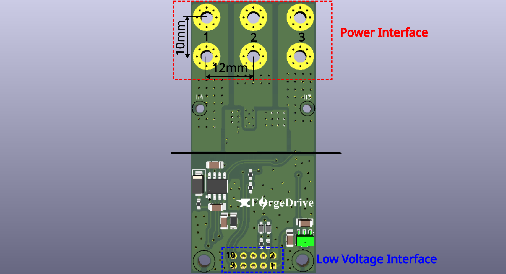

@import "../../forgex_doc_style.css"

# HBM_G0V48C15 Technical Reference

> **Project:** ForgeX  
> **Generation:** Gen0  
> **Document:** HBM_G0V48C15 Technical Reference  
> **Author:** Omar Magdy  
> **Revision:** Rev. 0  
> **Status:** Development  
> **Date:** September 2026

## Table of Contents
[TOC]

## 1. Introduction

The **HBM (Half-Bridge Module)** is the localized power-switching module of the ForgeX platform. It forms the primary power-conversion building block of the Gen0 three-phase inverter, with each inverter phase implemented using one HBM.

The module integrates the power switches, gate-drive circuitry, current and voltage measurement, local protection, and the associated high-frequency switching infrastructure into a physically localized power stage.

The **HBM_G0V48C15** is an updated Gen0 HBM implementation based on the revised electrical requirements. The module is resized from the original **400 V / 5 A** operating range to **48 V / 15 A**.

The updated power stage uses the **HGN036N08S MOSFET**, **EG2131 gate driver**, and **ACS712-20A current sensor**.

### 1.1 Naming

`HBM_G0V48C15` follows the ForgeX module naming convention:

- `HBM` — Half-Bridge Module
- `G0`  — Generation 0
- `V48` — 48 V voltage class
- `C15` — 15 A current class

The `V48C15` designation reflects the updated electrical operating range of the module, which is resized from the original 400 V / 5 A design to 48 V / 15 A.

The `C15` designation should not be interpreted as an unconditional continuous-current rating. The achievable current depends on operating conditions including cooling, switching frequency, thermal limits, PCB characteristics, and the applicable electrical and EMI constraints.

### 1.2 Overview

The HBM implements a single half-bridge power stage intended to be combined with other HBM modules through the ForgeX PMB and LVP interfaces.

The HBM_G0V48C15 is designed around the updated electrical operating range of **48 V / 15 A**, compared with the original 400 V / 5 A design.

The module is designed around the principle of **electrical locality**: the high-current switching path, gate-drive loop, local decoupling, current sensing, and switch-node structures are kept physically close to one another to minimize parasitic inductance and unwanted coupling.

The principal functions of the HBM are:

- 48 V half-bridge power switching
- Local MOSFET gate drive using the EG2131
- Phase-current measurement using the ACS712-20A
- Switch-node voltage measurement
- Local fault and protection handling
- Interface to the ForgeX PMB power infrastructure
- Low-voltage control interface to the ForgeX LVP

### 1.3 Design Files

The complete hardware design files for this module are maintained in the ForgeX repository:

**revA:**
- [PCB & Schematic](https://github.com/Omar-Magdy0/ForgeDriveHW/tree/main/ForgeX/HBM_G0V48C15/revA)
- **Simulation:** 🛠️
- [Manufacturing files](https://github.com/Omar-Magdy0/ForgeDriveHW/tree/main/ForgeX/HBM_G0V48C15/revA/production)
---
## 2. Interfaces & I/O

The HBM interfaces with the remainder of the ForgeX system through dedicated power and low-voltage interfaces.

### 2.1 Power Interface

The power interface consists of wide, dedicated copper interfaces designed to carry the HBM power current. The interfaces can be connected using lugs or copper spacers. The preceding figure shows the interface dimensions and their symmetric arrangement.

| Pin Number | Pin Name | Pin Description |
|-----------:|----------|-----------------|
| 1 | `VDC` | Positive DC-link input. Connects to the positive DC bus. |
| 2 | `PHASE` | Half-bridge switched output. Connects to the motor phase or load. |
| 3 | `PGND` | Power ground and negative DC-link return. |

### 2.2 Low-Voltage Interface

The low-voltage interface uses a 2.54 mm-pitch header. The interface is compatible with standard IDC and Dupont-style connectors.

A long-pin Dupont header may be used when access to the module's top-layer debug and test points is desired.

| Pin Number | Pin Name | Pin Description |
|-----------:|----------|-----------------|
| 1 | `VCC` | Low-voltage supply input for the gate-driver and interface circuitry. A 12 V supply is recommended. The supply is referenced to `GND`. |
| 2 | `GND` | Low-voltage ground reference. `GND` is connected to `PGND` at a designated system-level grounding point; the HBM does not provide galvanic isolation between these domains. |
| 3 | `HIN` | High-side gate-drive control input. |
| 4 | `LIN` | Low-side gate-drive control input. |
| 5 | `NC` | No connection. Reserved for future use or left electrically unconnected. |
| 9 | `VSENSE` | Voltage-sense output proportional to the switch-node voltage. |
| 10 | `ISENSE` | Current-sense output proportional to the measured phase current. |

---
## 3. Design Requirements

Requirements are what the HBM itself is supposed to achieve:

- 48 V DC-link operation
- 15 A class power handling
- Efficient switching operation from 8–20 kHz with manageable conduction and switching losses
- Controlled switch-node ringing and voltage overshoot within component and system limits
- Current measurement bandwidth targeted at approximately 1–1.2 kHz
- Robust operation in the presence of switching noise and transients
- Controlled conducted and radiated EMI to minimize interference with other system components

---
## 4. Constraints

The Gen0 HBM design is subject to several practical constraints.

A significant constraint is the limited local supply chain, with component availability primarily governed by vendors accessible in Egypt. Component selection therefore considers availability and replacement options in addition to electrical performance.

PCB fabrication is constrained by the DFM rules applicable to the available fabrication process:

- Maximum number of layers: 2
- Minimum track width: 0.25 mm
- Minimum clearance: 0.25 mm
- Minimum polygon-pour clearance: 0.3 mm
- Minimum via diameter: 0.9 mm
- Minimum via hole diameter: 0.4 mm
- Minimum annular ring: 0.5 mm
- Maximum single-board size: 38 cm × 28 cm
- Maximum double-board size: 28 cm × 22 cm

The Gen0 implementation additionally prioritizes:

- Cost effectiveness
- Component availability
- Simplicity
- Reliability
- Ease of debugging and modification
- Maintainability during development

---
## 5. Sizing and Component Selection

### 5.1 MOSFET

The selected MOSFET for the HBM power stage is the `HGN036N08S`. The device was selected based on its electrical characteristics, high-current capability, low conduction resistance, high-speed switching performance, package construction, and suitability for the intended 48 V / 15 A switching conditions.

**Datasheet:** [HGN036N08S](https://www.alldatasheet.net/view_datasheet.jsp?Searchword=HGN036)

**Selection rationale:**

* **80 V drain-source rating:** The device has an 80 V maximum $V_{DS}$ rating, providing voltage margin above the nominal 48 V DC-link voltage. This margin provides tolerance to switching-node overshoot and transient voltage spikes.
* **High current capability:** The HGN036N08S is specified with a continuous drain current of up to 60 A under the package-limited condition at $T_C = 25\,^\circ\mathrm{C}$, providing substantial current capability relative to the HBM's 15 A class operating current.
* **Low $R_{DS(on)}$:** The device has a typical $R_{DS(on)}$ of $3.0\,\mathrm{m\Omega}$ at $V_{GS} = 10\,\mathrm{V}$ and $I_D = 20\,\mathrm{A}$. The low on-state resistance helps reduce conduction losses during normal operation.
* **Low gate charge:** The total gate charge $Q_G$ is $61\,\mathrm{nC}$, while the gate-to-drain (Miller) charge $Q_{GD}$ is $18\,\mathrm{nC}$. These parameters are considered in the gate-drive and switching-speed calculations.
* **High-speed switching:** The datasheet specifies the device for high-speed power switching and hard-switching applications, making it suitable for the HBM's intended switching-frequency range.
* **Enhanced body-diode $dv/dt$ capability:** The device includes enhanced body-diode $dv/dt$ capability, which is beneficial in the switching environment of a half-bridge power stage.
* **Package:** The MOSFET is provided in a compact DFN5×6 package, supporting a physically localized power stage and short high-current switching paths.

### 5.2 Gate Drive

The selected gate-driver IC for the HBM is the `EG2131` from EG Micro.

**Datasheet:** [EG2131](https://www.lcsc.com/datasheet/C193777.pdf)

**Selection rationale:**

* **Local availability and cost:** The device is readily available from local suppliers at a relatively low unit cost, making it practical for prototyping, production, and replacement.
* **300 V high-side operating capability:** The high-side floating section is rated for operation up to **300 V**, providing sufficient voltage margin for the HBM's nominal **48 V DC-link**.
* **High gate-drive current:** The driver provides up to **1 A source current** and **1.5 A sink current**, providing sufficient drive capability for the selected MOSFET at the intended switching frequencies.
* **Integrated interlock and deadtime:** The device incorporates half-bridge interlock logic and internal deadtime generation, with a typical deadtime of approximately **250 ns**. This provides protection against simultaneous turn-on of the high-side and low-side MOSFETs.
* **Bootstrap high-side drive:** The high-side driver uses a floating bootstrap supply to drive the high-side MOSFET. The bootstrap supply is implemented using an external bootstrap diode and capacitor, eliminating the need for a separate isolated high-side gate-drive supply and simplifying the gate-drive implementation.

### 5.3 External Components

#### 5.3.1 Gate Resistor

The external gate resistor was selected to establish the target switching speeds while providing a practical compromise between switching losses, switch-node $dv/dt$, voltage overshoot, ringing, and electromagnetic interference (EMI).

An initial target of approximately **40 ns turn-on** and **25 ns turn-off** transition time during the Miller plateau was selected for the `HGN036N08S`.

The resulting target switch-node slew rates are approximately:
- **Turn-on slew:** \(\approx 1.2\,\mathrm{V/ns}\)
- **Turn-off slew:** \(\approx 1.9\,\mathrm{V/ns}\)

These values provide a controlled switching transition while keeping the
switching losses within an acceptable range.

**Gate Current Calculations**

The gate current required during the Miller transition is derived from the MOSFET Miller charge ($Q_{Miller} \approx 10\,\mathrm{nC}$):

$$I_G \approx \frac{Q_{Miller}}{t_{Miller}}$$

- **Turn-On Target ($t_{on} = 40\,\mathrm{ns}$):**
  $$I_{G,on} = \frac{Q_{Miller}}{t_{on}} = \frac{10\,\mathrm{nC}}{40\,\mathrm{ns}} = 250\,\mathrm{mA}$$

- **Turn-Off Target ($t_{off} = 25\,\mathrm{ns}$):**
  $$I_{G,off} = \frac{Q_{Miller}}{t_{off}} = \frac{10\,\mathrm{nC}}{25\,\mathrm{ns}} = 400\,\mathrm{mA}$$

**Turn-On**

The gate current can alternatively be modeled using the gate-drive supply voltage, Miller plateau voltage, and the loop resistance:

$$I_{G,on} = \frac{V_{DRV} - V_{PL}}{R_{Gate,Internal} + R_{Driver,Source} + R_{Gate,External,Source}}$$

Using the parameters:
- $V_{DRV} = 12\,\mathrm{V}$ (Gate driver supply voltage)
- $V_{PL} \approx 4.0\,\mathrm{V}$ (HGN036N08S Miller plateau voltage)
- $R_{Gate,Internal} = 2.0\,\Omega$ (MOSFET intrinsic gate resistance)
- $R_{Driver,Source} \approx \frac{V_{DRV} - V_{PL}}{I_{O+}} = \frac{12\,\mathrm{V}}{1.0\,\mathrm{A}} = 12.0\,\Omega$ (Effective EG2131 driver source resistance)

Substituting $I_{G,on} = 250\,\mathrm{mA}$ into the loop equation gives the total required resistance:

$$R_{Loop,Total} = \frac{12\,\mathrm{V} - 4.0\,\mathrm{V}}{0.25\,\mathrm{A}} \approx 32\,\Omega$$

Solving for the external resistor value:

$$R_{Gate,External,Source} = R_{Loop,Total} - R_{Driver,Source} - R_{Gate,Internal}$$

$$R_{Gate,External,Source} = 32\,\Omega - 12.0\,\Omega - 2.0\,\Omega = 18\,\Omega$$

Rounding up to the nearest standard E24 resistor value yields:

$$\boxed{R_{Gate,External,Source} \approx 22\,\Omega}$$

**Turn-Off**

The turn-off gate current can similarly be estimated from:

\[
I_{G,off}
=
\frac{V_{PL}}
{R_{Gate,Internal}+R_{Gate,Driver,Sink}+R_{Gate,External,Sink}} = 400 \,\mathrm{mA}
\]

Using:

\[
\begin{aligned}
V_{PL} &\approx 4\,\mathrm{V} \\
R_{Gate,Internal} &= 2\,\Omega
\qquad\text{(MOSFET intrinsic gate resistance)}\\
R_{Gate,Driver,Sink} &= 8\,\Omega
\qquad\text{(EG2131 datasheet)}\\
R_{Gate,External,Sink} &\approx 0\,\Omega
\end{aligned}
\]

Using a bypass diode across the gate resistor in the sinking direction yeilds effective 32 $\Omega$ Source gate resistance and 10 $\Omega$ Sink resistance

**First-Order Switching Loss Estimate**

A first-order estimate of the voltage-current overlap switching loss for a single MOSFET is:

$$P_{SW} \approx \frac{1}{2}V_{DS}I_D(t_{on} + t_{off})f_{SW}$$

For a 48 V DC-link, 15 A operating current, and 20 kHz switching frequency using $t_{on} = 40\,\mathrm{ns}$ and $t_{off} \approx 25\,\mathrm{ns}$:

$$P_{SW} \approx \frac{1}{2} \times 48\,\mathrm{V} \times 15\,\mathrm{A} \times (40\,\mathrm{ns} + 25\,\mathrm{ns}) \times 20\,\mathrm{kHz} \approx 0.468\,\mathrm{W}$$

**$dv/dt$ Constraints & Immunity**

- **Miller-Induced False Turn-On Limit:**
  $$\left(\frac{dV}{dt}\right)_{Miller,Limit} = \frac{V_{TH}}{(R_{Gate,Internal} + R_{Driver,Sink} + R_{Gate,External,Sink}) C_{GD}}$$
  Using $V_{TH} \approx 2.5\,\mathrm{V}$ and $C_{GD} \approx 30\,\mathrm{pF}$ (high-$V_{DS}$ region):
  $$\boxed{\left(\frac{dV}{dt}\right)_{Miller,Limit} \approx 8.33\,\mathrm{V/ns}}$$
  The actual switch-node slew rate ($\approx 1.9\,\mathrm{V/ns}$) remains safely below this limit, avoiding false turn-on.

- **Gate-Driver $dv/dt$ Immunity:** The EG2131 specifies driver immunity above $50\,\mathrm{V/ns}$, well above operational slew rates.
- **MOSFET $dv/dt$ Capability:** No explicit MOSFET \(dv/dt\) rating is specified in the available HGN036N08S datasheet. Nevertheless, the selected switching slew rate of approximately \(1.2\,\mathrm{V/ns}\) during turn-on and \(1.9\,\mathrm{V/ns}\) during turn-off is relatively moderate for a modern low-voltage power MOSFET and is not considered an aggressive switching condition.

**Parasitic Inductive Voltage**

For $di/dt = 15\,\mathrm{A} / 40\,\mathrm{ns} = 0.375\,\mathrm{A/ns}$, an estimate worst case power-loop inductance $L_{Power} = 20\,\mathrm{nH}$, and source inductance $L_{Source} = 10\,\mathrm{nH}$:

$$V_{L,Total} = (L_{Power} + L_{Source}) \frac{di}{dt} = (20\,\mathrm{nH} + 10\,\mathrm{nH}) \times 0.375\,\mathrm{A/ns} \approx 11.25\,\mathrm{V}$$

This voltage spike of $ 48 + 11.25 = 59\mathrm{V} $ is safely within the 80 V rating of the HGN036N08S.

#### 5.3.2 Bootstrap Capacitor

The bootstrap capacitor provides the local energy reservoir and low-impedance current path required to drive the high-side MOSFET. Because the high-side gate is charged through this capacitor, its value must be sufficiently large to maintain the bootstrap supply above the gate driver's high-side UVLO threshold throughout the switching cycle.

A simple design rule is to select the bootstrap capacitance as at least ten times the effective gate capacitance of the MOSFET:

$$C_{BOOT} \ge 10C_G$$

where the effective gate capacitance is:

$$C_G = \frac{Q_G}{V_{GS}} = \frac{61\,\mathrm{nC}}{10\,\mathrm{V}} = 6.1\,\mathrm{nF}$$

This gives a minimum threshold of $C_{BOOT} \ge 61\,\mathrm{nF}$.

A substantially larger **1 µF** bootstrap capacitor was selected for the HBM to provide hold-up robustness.

$$\Delta V_{BOOT} = \frac{\Delta Q}{C_{BOOT}} = \frac{61\,\mathrm{nC}}{1\,\mathrm{\mu F}} = 61\,\mathrm{mV}$$

Even across 10 consecutive switching cycles without recharge, the voltage droop is only $\approx 610\,\mathrm{mV}$, keeping the supply well above the driver UVLO limit.

#### 5.3.3 VCC Decoupling Capacitor

The gate-driver supply requires a local decoupling network to provide high-frequency current demanded by the `EG2131` gate-drive output stage:

$$\boxed{C_{VCC}=10\,\mathrm{\mu F}}$$

$$\boxed{C_{HF}=0.1\,\mathrm{\mu F}}$$

The 10 µF capacitor provides local bulk energy storage, while the 0.1 µF ceramic capacitor provides a low-impedance path for high-frequency current components during gate-drive transitions.

#### 5.3.4 RC Snubber

Using an estimated switching-loop inductance $L_0 = 20\,\mathrm{nH}$ and MOSFET output capacitance $C_{oss} \approx 565\,\mathrm{pF}$, initial snubber parameters are calculated as:

$$C_{snub} \approx 4 \times C_{oss} \approx 2.26\,\mathrm{nF} \implies \boxed{C_{snub} = 2.2\,\mathrm{nF}}$$

$$R_{snub} \approx \sqrt{\frac{L_0}{C_{oss}}} \approx 5.95\,\Omega \implies \boxed{R_{snub} = 6.2\,\Omega}$$

At 48 V and 20 kHz, snubber power dissipation is estimated as:

$$P_{snub} \approx C_{snub}V_{DS}^{2}f_{SW} \approx 2.2\,\mathrm{nF} \times (48\,\mathrm{V})^2 \times 20\,\mathrm{kHz} \approx 0.101\,\mathrm{W}$$

### 5.4 Current Sensing

The **ACS712-20A** fully integrated Hall-effect current sensor IC is selected for phase-current measurement.

**Sensitivity and Output Characteristics**

- **Zero-Current Output Voltage ($V_{bias}$):** $2.5\,\mathrm{V}$ (at $V_{CC} = 5.0\,\mathrm{V}$)
- **Sensitivity:** $\boxed{100\,\mathrm{mV/A}}$
- **Measurement Range:** $\boxed{\pm 20\,\mathrm{A}}$ ($0.5\,\mathrm{V} \le V_{OUT} \le 4.5\,\mathrm{V}$)

An attenuation resistor divider ($R_1 = 10\,\mathrm{k\Omega}, R_2 = 20\,\mathrm{k\Omega}$, scaling factor $2/3$) maps the sensor output range to **$0.333\,\mathrm{V} \le V_{ADC} \le 3.0\,\mathrm{V}$**, safely within the 3.3 V ADC input range.

**Conduction Loss**

For a 15 A peak current ($I_{RMS} \approx 10.61\,\mathrm{A}$) and primary conductor resistance $R_{primary} \approx 1.2\,\mathrm{m\Omega}$:

$$P_{sensor} = (10.61\,\mathrm{A})^2 \times 1.2\,\mathrm{m\Omega} \approx 0.135\,\mathrm{W} \implies \boxed{P_{sensor} \approx 135\,\mathrm{mW}}$$

**Bandwidth Adjustment for PWM Ripple Rejection for Inline Measurement**

To suppress high-frequency switching noise while avoiding significant attenuation and phase delay within the current-control bandwidth, the ACS712 sensor bandwidth is targeted at approximately **\(20\,\mathrm{kHz}\)**, corresponding to the maximum PWM/control update rate. Deterministic PWM ripple is primarily mitigated through **synchronous mid-PWM sampling**, rather than relying solely on the analog filter.

Using the ACS712 internal filter resistance of approximately

$$
R_{F(\mathrm{INT})}=1.7\,\mathrm{k\Omega}
$$

and an external filter capacitor \(C_F\), the first-order filter cutoff frequency is

$$
f_c=\frac{1}{2\pi R_{F(\mathrm{INT})}C_F}
$$

Therefore,

$$
C_F=
\frac{1}{2\pi(1.7\,\mathrm{k\Omega})(20\,\mathrm{kHz})}
\approx 4.68\,\mathrm{nF}
$$

A standard capacitor value of

$$
\boxed{C_F=4.7\,\mathrm{nF}}
$$

is selected, resulting in an actual cutoff frequency of approximately

$$
\boxed{f_c\approx19.9\,\mathrm{kHz}}
$$

This bandwidth provides a relatively small phase and amplitude impact on the current-control dynamics while providing attenuation of higher-frequency switching noise. Synchronous mid-PWM sampling further reduces the influence of deterministic PWM switching ripple.

### 5.5 Voltage Sensing

The switch-node and DC-link voltages are scaled down to the 0–3.3 V range using a dedicated resistor divider network.

To satisfy the input sampling-time constraints of microcontroller SAR ADCs without requiring an active operational-amplifier buffer, a low-impedance network is selected:

$$\boxed{R_1 = 47\,\mathrm{k\Omega}, \quad R_2 = 2.7\,\mathrm{k\Omega}}$$

**Transfer Function & Voltage Mapping:**

$$\text{Transfer Ratio} = \frac{R_2}{R_1 + R_2} = \frac{2.7\,\mathrm{k\Omega}}{47\,\mathrm{k\Omega} + 2.7\,\mathrm{k\Omega}} = 0.0543\,\mathrm{V/V}$$

- **48 V Nominal Input:** $V_{ADC} = 48\,\mathrm{V} \times 0.0543 = 2.608\,\mathrm{V}$
- **60 V Transient Maximum:** $V_{ADC} = 60\,\mathrm{V} \times 0.0543 = 3.259\,\mathrm{V} \quad (< 3.3\,\mathrm{V} \text{ ADC Limit})$

**Trade-Off Analysis & Impedance Comparison:**

| Parameter | High-Impedance Pair ($180\,\mathrm{k\Omega} + 10\,\mathrm{k\Omega}$) | Selected Low-Impedance Pair ($47\,\mathrm{k\Omega} + 2.7\,\mathrm{k\Omega}$) |
| :--- | :---: | :---: |
| **Transfer Ratio** | $0.0526\,\mathrm{V/V}$ | **$0.0543\,\mathrm{V/V}$** |
| **Full-Scale (60 V Transient)** | $3.158\,\mathrm{V}$ | **$3.259\,\mathrm{V}$** |
| **Thevenin Source Impedance ($R_{TH}$)** | $9.47\,\mathrm{k\Omega}$ | **$2.55\,\mathrm{k\Omega}$** |
| **Power Dissipation at 48 V** | $12.1\,\mathrm{mW}$ | **$46.3\,\mathrm{mW}$** |
| **ADC Sampling Compatibility** | Requires large sampling time or buffer | **Direct SAR ADC connection ($R_{S} \le 2.5\text{--}5\,\mathrm{k\Omega}$)** |

**Selection Rationale:**

The $47\,\mathrm{k\Omega} + 2.7\,\mathrm{k\Omega}$ pair provides an equivalent Thevenin source impedance $R_{TH} = R_1 \parallel R_2 \approx 2.55\,\mathrm{k\Omega}$, aligning with standard MCU ADC source impedance requirements ($R_S \le 2.5\text{--}5\,\mathrm{k\Omega}$) and enabling accurate sampling at high PWM frequencies. The $46.3\,\mathrm{mW}$ power dissipation is negligible relative to the 720 W power rating of the module.

Resistor $R_1$ can be implemented using two $24\,\mathrm{k\Omega}$ surface-mount resistors in series to distribute power dissipation and meet PCB creepage/clearance constraints.

### 5.7 References
* [TI — Bootstrap Circuitry Selection for Half-Bridge Configurations](https://www.ti.com/lit/an/slua887a/slua887a.pdf)
* [Infineon — Using Monolithic High-Voltage Gate Drivers](https://www.infineon.com/row/public/documents/24/42/infineon-using-monolithic-high-voltage-gate-drivers-applicationnotes-en.pdf)
* [Seminar 1400 Topic 2 APDX Estimating MOSFET Parameters from the Data Sheet](https://www.ti.com/lit/ml/slup170/slup170.pdf?ts=1786803369734)

---

Note: This section is currently under development. Simulation models and hardware validation results are being updated for the latest module revision and will be finalized upon complete testing.

